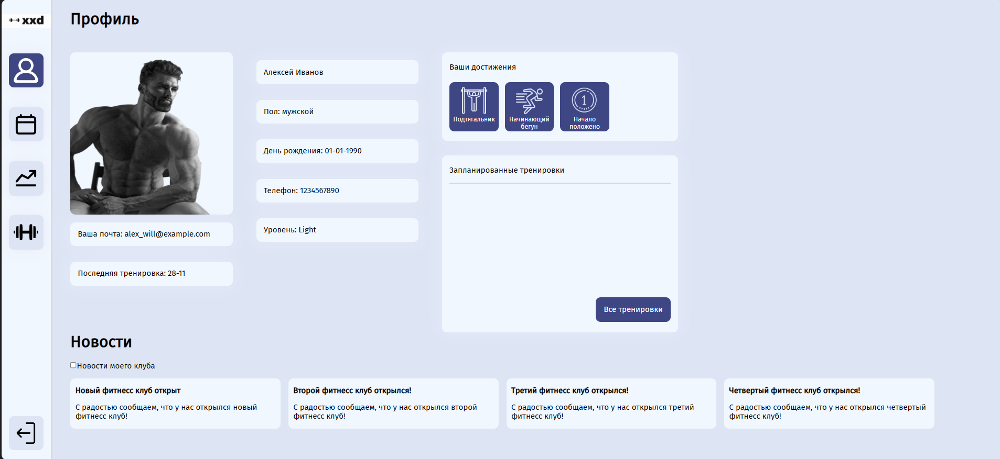
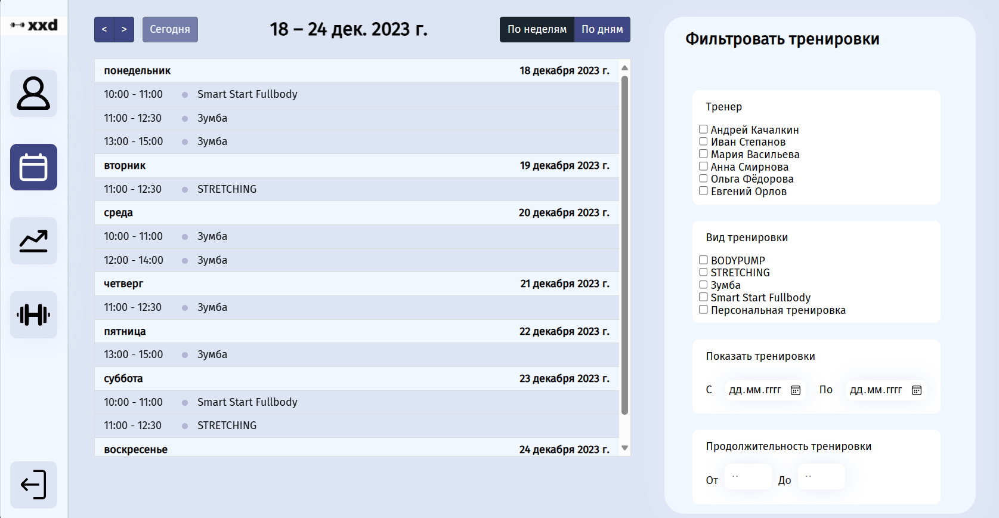
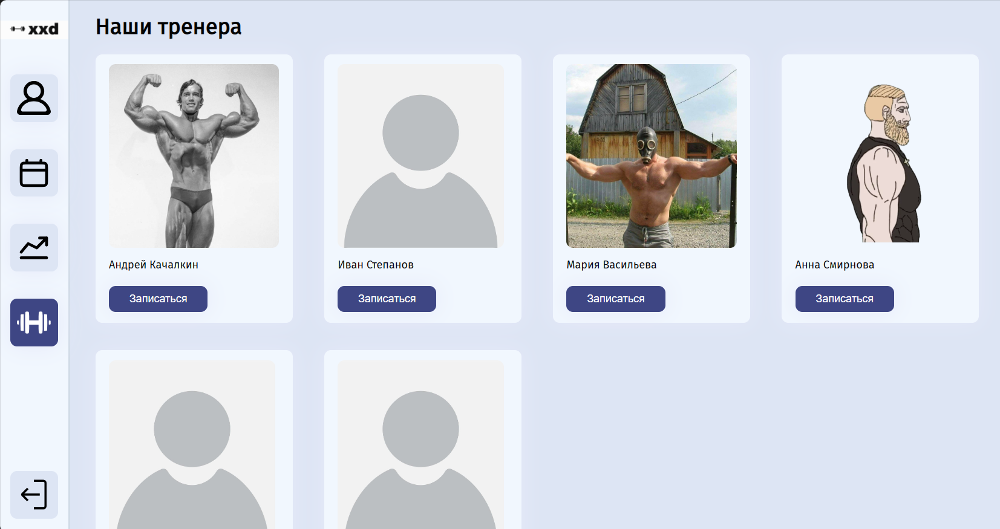

# About
Pet-проект, а так же итоговая работа для дисциплины ПИСиБДРВ (Проектирование информационных систем и баз данных реального времени).
Это реализация backend'а сервиса сети фитнесс клубов, основанная на MVC

## Screenshots




 ## Dependencies

 - Apache Maven 3.9.4 
 - MySQL 8.4
 - Java 20.0.2

## Start with Docker

```
    $ ./start.sh
```

## Test Users
|Username|password|Role|
|--------|--------|----|
|JohnDoe|12345678|MEMBER|
|andrew.kachalkin|qwerty|TRAINER|
|pavelP|87654321|STAFF|
